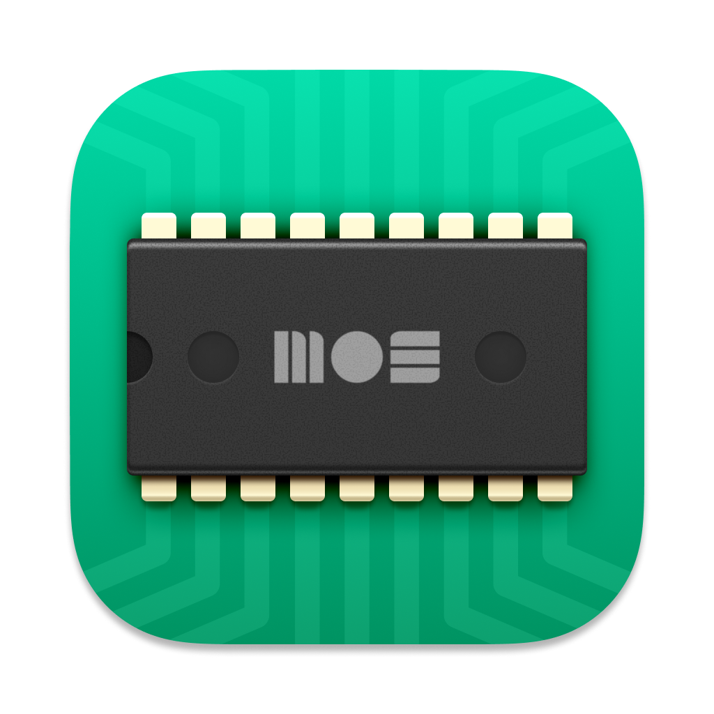

<h1> ultraSID</h1>
Open source SID player deluxe. Uses Toddler-Boy/libSidplayEZ. Requires the HVSC.

## Features

- State-of-the-art, cycle-exact SID/CPU emulation. The tunes will play like on real hardware. No compromises.
- Curated 6581 filter settings for the most popular SID authors. You've never heard these tunes like this before.
- Optional audio-processing to get various enhancements, like widened stereo field, reverb, etc.
- ReplayGain, so all tunes play at a standard volume. Playlists sound even with no sudden jumps or dips in volume.
- Best in class CRT simulation for both PAL and NTSC. See title screens and game screenshots for the tune you're playing.
- Chip visualization lets you see what's going on with each voice and the filter.
- Songs can be scrubbed. Jump to any position within the song, just like any regular media player.
- Playlist support with shuffle, repeat, etc.
- Super fast and easy to use HVSC search. You will see the results while you type.
- Full HVSC support, including song-lengths and STIL.
